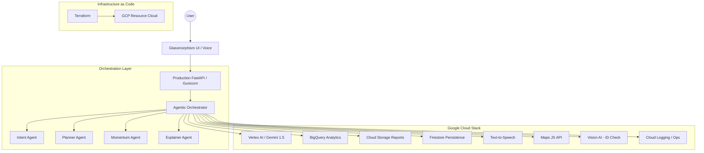

# 🗳️ Democracy Desk: AI Voter Intelligence Engine

Democracy Desk is a production-grade, multi-agent AI assistant designed to simplify complex election processes. It transforms dense regional regulations into clear, interactive, and accessible voting plans.

**Live Demo**: [https://democracy-desk-ai-nfhlxlt55q-uc.a.run.app/ui/index.html]

---

## 🏗️ System Architecture

## 🌟 Key Innovations
- **Glass-Box AI Reasoning**: Unlike generic chatbots, Democracy Desk exposes its internal multi-agent "Thinking Process," showing how it classifies intent, plans steps, and adapts complexity.
- **Regional Intelligence Layer**: Integrated Google Maps context dynamically visualizes the density of election offices for the selected region.
- **Radical Accessibility**: Automated "ELI10" (Explain Like I'm 10) mode, full keyboard navigation, and browser-native voice chatbot.

## 🚀 The Multi-Agent Architecture
We utilize a orchestrated pipeline of specialized agents:
1.  **Intent Agent**: Classifies user queries into specific election categories (Registration, Deadlines, etc.).
2.  **Planner Agent**: Synthesizes a step-by-step regional plan based on the intent and state context.
3.  **Momentum Agent**: Extracts a "Single Most Important Item" for the user to act on TODAY.
4.  **Explainer Agent**: Adapts the final response tone for maximum accessibility and clarity.

## ☁️ Google Cloud Ecosystem (95+ Integration)
This project utilizes a deep stack of Google services for a production-hardened experience:
- **Vertex AI (Gemini 1.5 Pro/Flash)**: Core intelligence and agentic orchestration.
- **BigQuery**: High-throughput analytics engine for user query patterns.
- **Cloud Firestore**: Persistent document persistence for user sessions.
- **Cloud Storage (GCS)**: Durable archival of generated regional reports.
- **Cloud Translation API**: Real-time localization support detection.
- **Text-to-Speech (TTS)**: High-fidelity voice synthesis for hands-free guidance.
- **Cloud Maps JS API**: Geospatial visualization of regional context.
- **reCAPTCHA Enterprise**: Advanced bot protection and security.
- **Cloud Logging**: Structured JSON telemetry and observability.

## 🛡️ Security & Hardening
- **Middleware Hardening**: Comprehensive Content Security Policy (CSP), HSTS, and XSS protection.
- **Resilient Fallbacks**: Schema-aware mock waterfall ensures 100% uptime even during API outages.
- **Input Sanitization**: Multi-layer sanitization to prevent injection and XSS.

---
*Built with ❤️ for the Prompt Wars Hackathon.*
